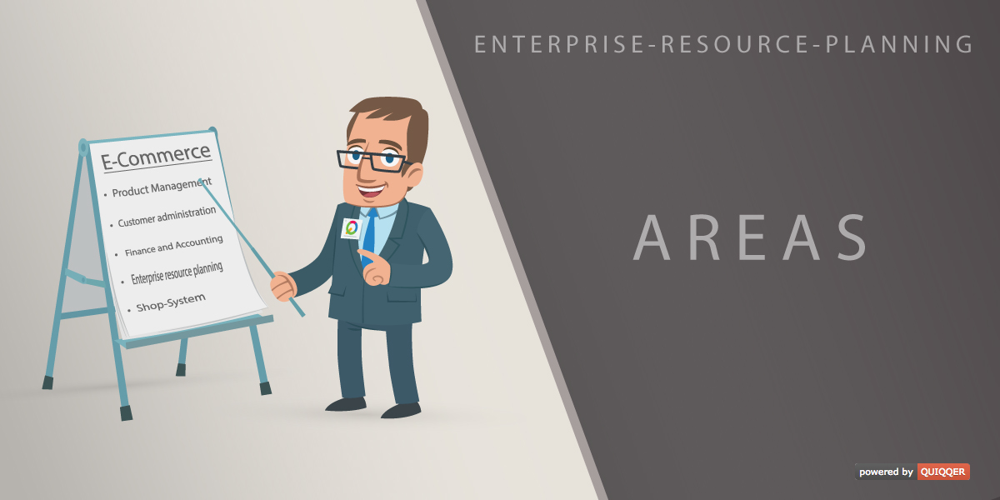

QUIQQER Areas
========

The QUIQQER Areas module allows you to group countries into so-called areas. 
Define different tax zones or shipping zones and determine different behaviors 
for your shop for different countries.

- In combination with the QUIQQER Tax module, different VAT zones can be set up.
- In combination with the QUIQQER Discount module you can offer different discounts for different areas.

Package name:

    quiqqer/areas

Features
--------

- Area Management for ERP
- Import of areas for digital goods in the EU

Installation
------------

The package name: quiqqer/areas

Contribution
----------

- Issue Tracker: https://dev.quiqqer.com/quiqqer/areas/issues
- Source Code: https://dev.quiqqer.com/quiqqer/areas

Support
-------

If you have found a bug, or want improvements,
then you are welcome to send an e-mail to support@pcsg.de

Licence
-------

GPL-3.0+
